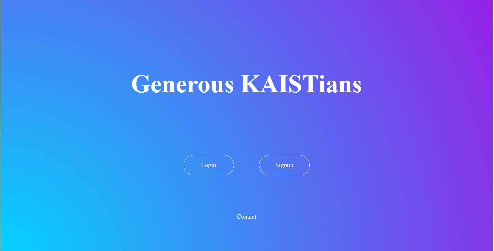
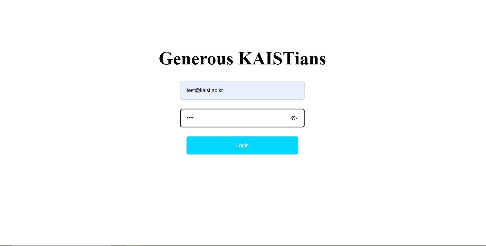
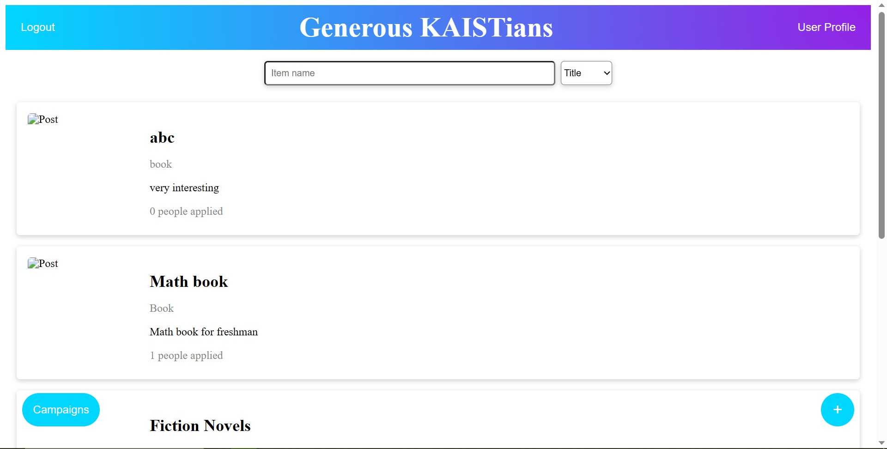
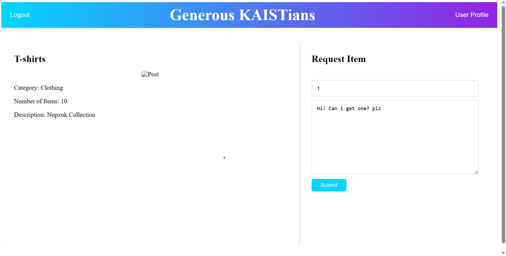
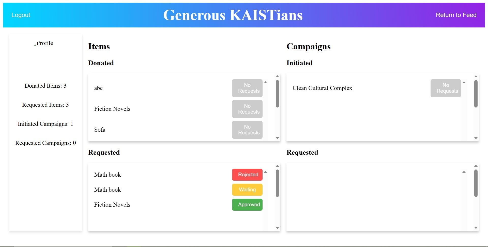
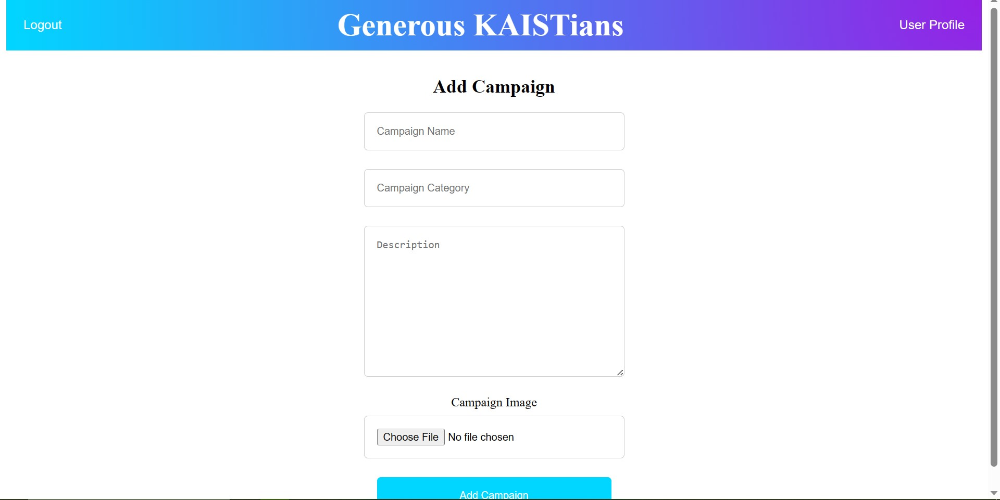

# CS350_Project_Generous_KAISTian

## Introduction
The Generous KAISTians is an easy-to-use platform that allows people to donate
items, offer help, request assistance, connect with others, and promote volunteerism
in a convenient manner. Through the web, KAIST people will be able to publish
about the donating items and connect with the people who want to acquire them.

## Features
Login & Sign up 
User can signup via KAIST email and login
{: width="50%" height="50%"} {: width="50%" height="50%"}

Feed page
{: width="50%" height="50%"}

Add item post
User can upload post to donate item.


Request
User can request item through request page.
{: width="50%" height="50%"}

User profile
User can check uploaded posts and request status.
{: width="50%" height="50%"}

Initiate Campaign 
User can write a post about campaign.
{: width="50%" height="50%"}

## How to run
Clone this repository.  
```git clone```

Move to generous_kaistian folder.   
```cd ./generous_kaistian```

Install dependencies.   
```npm install```

Run.    
```npm run dev```

